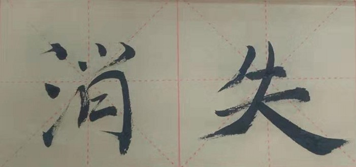

# 优秀的消失

## 集体的没落 

我在的一届是悲伤的一届，我基本不能从身边的班级里面获取力量。

大学扩招了、师范院校学生的积极性、学校分数本身较差、北京学生不需要太努力就能进入学校门槛。

教书从来都不是大学教师的主业，学生以母校为荣，可是学校以他为荣吗？学校的科研、尖端技术、突破性发展，是进来的那些年纪尚小的新生们缔造的吗？不是啊，是最尖端的院长教授们和最顶尖的成熟的学生共同创造的，可是课程算什么，院长开的导论课算什么。。。真可惜呀，这些集体并不是高价值的，价值密度极低，大学教育的内在冲突大概就在于此了吧。

## 个人的滑坡

我，我迷失了我自己，或者说找不到目标没有主心骨的我，就会融入周围环境。

我总能完美的融入环境，和身边最好的朋友成为好朋友，除非我不想。当然也有例外************。话说回来，我到哪个环境，好像就能顺杆而上。那我的局限就仅仅在于我最高能够跳到哪个环境里对吧。所以个人优秀的消失，在我看来，还是环境的问题，我们和环境相融共生，互促互进。如果我们费尽全身的力气，带着满身伤痕和后遗症挣脱出来，那么一定会陷入滑坡里面。

我把个人和差劲的环境在做对立，好像我总喜欢做各种对立，我的人生就是负重前行，我当然知道双赢是最好的策略，可是，这个情况我感觉好像不是很能做到双赢。

总之，滑坡，旁边有一片带着利刃的阻力带，关键在于我看不看得见，舍不舍得跳上去了。

## 应对的策略

大无畏的勇气

支撑勇气的信念和使命

眼光

方法、模式：健康、可持续发展hh

身边的朋友

<<<<<<< HEAD

=======

>>>>>>> a47b91660f7d0e7e9df8a9963eb771649509ad7b

 